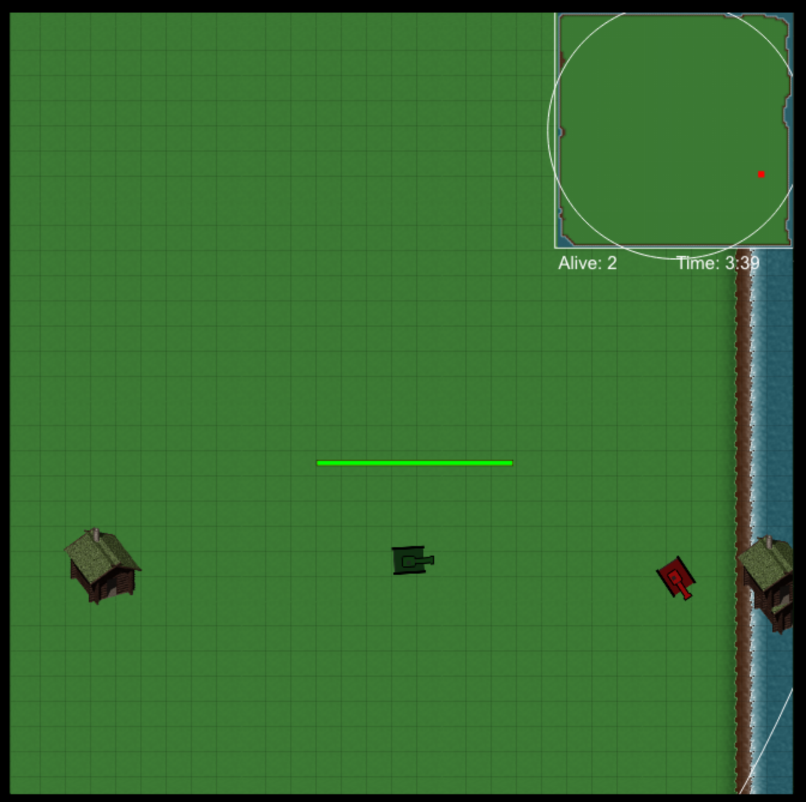

# Final Project for CS5410 - Game Development, Spring 2018 

## A Web based, 2D, Battle Royale Game created by Bobby Handley and Jack Thomas

### To run the game:
1. npm install the required modules
2. npm start
3. Go to localhost:3000 on a browser

### Additional Notes:
The game begins once there is enough players in the lobby. 
The required number can be changed in server/game.js (Default set at 2).
